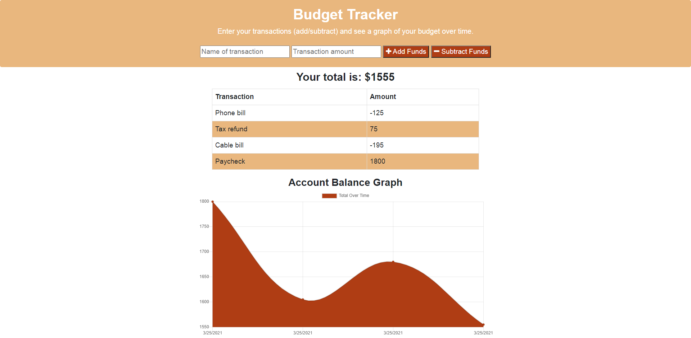

# Budget Tracker

The Budget Tracker is an application to allow a user to track their expenses both in an online and offline capacity.  A user enters a name for the transaction along with an amount.  The user then clicks a button to either add or subtract that value as the transaction amount.  The new balance is displayed and a graph charting the transactions is displayed.

As the user utilizes the application while connected to internet, the entries are stored in a mongo Atlas database.  If the user loses the internet connection and goes offline, then any transactions continued to be made on the page are then stored instead in an IndexedDb for the browser.   Upon reconnection to the internet, the entries made while offline are then copied to the Atlas database and the IndexedDb is cleared.

This application utilizes a no-sql database along with an IndexedDb (while in offline mode).  The application is also a progressive web application (PWA) that incorporated a manifest file and a service worker.  The application has been deployed to Heroku and connected to a mongo Atlas database.

## Table of Contents
* [Screenshots](#Screenshots)
* [Installation](#Installation)
* [Usage](#Usage)
* [Technologies](#Technologies)
* [Repository](#Repository)
* [Deployment](#Deployment)

#### Home Page
The following is a screenshot of the Budget Tracker home page when no data present.

  

#### Budget Tracker with Data
The following is a screenshot of the Budget Tracker after some transactions have been made.

  

## Installation

* Install node.js to computer, if not already present.
    * Node.js can be installed from [here](https://nodejs.org/en/)
* Copy all the application files locally to one's machine.
* In a terminal window where you copied the files, install 'mongoose', 'compression', 'express', 'lite-server' and 'morgan'.    These installations are accomplished by performing the following command: 

    * **npm install**

## Usage

This application requires Node.js to be installed.  It also requires the user to have 'mongoose', 'morgan', 'compression', 'lite-server' and 'express packages installed.  (See [Installation](#installation) section.)  Once these items have been installed, the user can launch the application from a terminal window as follows:

**node server.js**

Followed by entering localhost:3000 in your browser URL line.  The application can alternatively be run as a deployed application following the link in the Deployment section.

## Technologies

* Mongoose
* Express
* Node.js
* Heroku
* Atlas
* morgan
* MongoDb
* compression
* IndexedDb
* PWA

## Repository

Direct link to repository:  https://github.com/jtoth7824/Budget_Tracker

## Deployment

The Workout Tracker application was deployed to Heroku so that anyone can run the application.   The link to execute the application is as follows:

https://mighty-castle-87506.herokuapp.com
